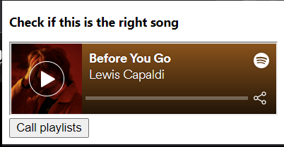
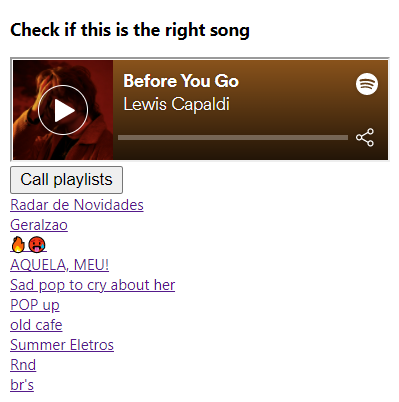
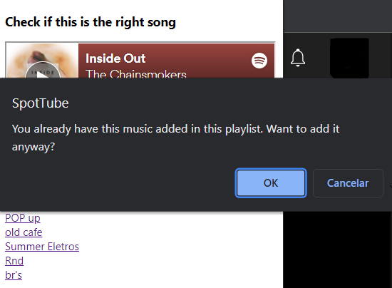

# SpotTube

A chrome extensions that has the backend in Flask, deployed
at Heroku ('https://flask-chrome-extension.herokuapp.com/') 
and the client side in JS.

Once the extension got clicked it shows a popup containing 
an embed of the item searched and a button to call your playlists

After call the playlists the user have the playlists

And then, finally, if I click into some link we got the item added into our playlists.
In case that we already have it added, we are requested to confirm if we want to add it anyway  

